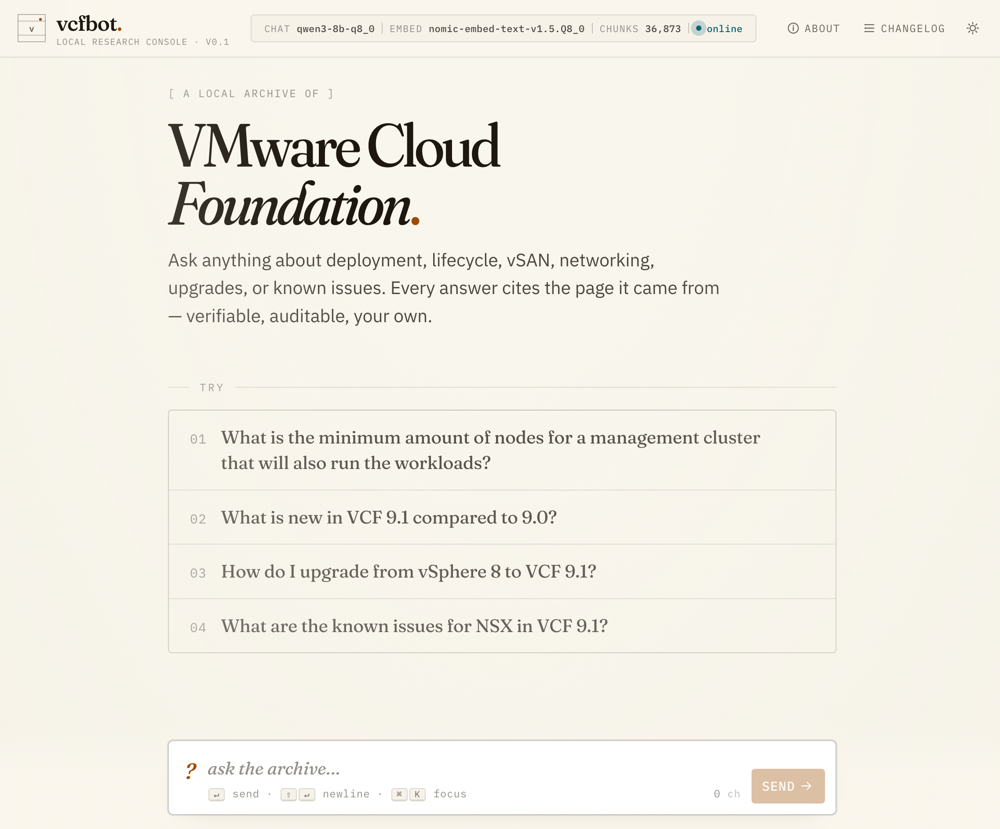

# vcfbot

A local RAG chatbot over Broadcom / VMware Cloud Foundation techdocs PDFs.
Talks to any OpenAI-compatible inference endpoint (LM Studio, llama.cpp,
Ollama, etc.) and returns answers with page-accurate citations into the
source PDF.



## About this project

This is a personal research tool. It is **not affiliated with, endorsed by,
or supported by Broadcom or VMware**. The bot fetches Broadcom's publicly-
hosted technical documentation PDFs on demand and runs retrieval-augmented
generation against them locally; nothing leaves the host running vcfbot.
If you deploy this, **you are responsible for complying with Broadcom's
terms of service** regarding access to those documents. The codebase is
generic — point `src/vcfbot/sources.py` at any set of PDFs you have a
right to use and the same pipeline applies.

## Pipeline

```
fetch   →   extract   →   chunk   →   embed   →   chroma   →   chat
(httpx)    (pymupdf)    (tiktoken)  (nomic)     (local)     (qwen3)
```

- **One source PDF** today: `vmware-cloud-foundation-9-1.pdf` — the entire
  VCF 9.1 doc set is published by Broadcom as a single 184 MB, 9,158-page
  PDF. New documents go in `src/vcfbot/sources.py`.
- **Page-accurate citations.** Each chunk tracks its page range and a
  hierarchical section path derived from the PDF outline (e.g.
  `Design › Storage Detailed Design › vSAN Storage Models › Single-Rack
  vSAN ESA Storage Model`). The model is prompted to cite as
  `[source-stem p.N]`; the UI renders those as clickable amber pills that
  scroll-spotlight the matching source card. ⌘-click jumps directly into
  Broadcom's hosted PDF at the cited page.
- **nomic-embed-text-v1.5 prefixes.** `search_document:` on stored
  chunks, `search_query:` on retrieval — the model was trained to expect
  these. Auto-applied when `EMBED_MODEL` contains `nomic-embed`.
- **Token-aware batching + adaptive retry.** nomic-embed has a hard
  context ceiling of 2,048 tokens. VMware text tokenizes ~6–7× heavier in
  BERT WordPiece than cl100k (lots of dashed acronyms), so chunks default
  to a small **`TARGET_TOKENS=220` cl100k** to stay safely under. On any
  embed-server overflow error, `index.py::_embed_adaptive` halves the
  batch and retries; oversized single inputs are truncated by half until
  they fit.
- **Paragraph-aware chunking.** `chunk.py` splits PDF text on blank lines
  first, then packs paragraphs into a chunk until the next one would
  exceed `TARGET_TOKENS`. Only oversize *single* paragraphs fall back to
  hard token-boundary splitting. The naive alternative (slice every N
  chars) would cut mid-sentence and produce noisier embeddings.

## Prereqs

You need an OpenAI-compatible chat endpoint and an OpenAI-compatible
embeddings endpoint. They can be the same server or two separate ones —
set `LM_STUDIO_URL` for a unified server, or `CHAT_BASE_URL` /
`EMBED_BASE_URL` independently for a split deployment.

**Recommended chat model**: Qwen3 series. The system prompt is
`/nothink`-prefixed because Qwen3 reasoning mode is on by default and
tends to conflate adjacent requirements in dense RAG context.

**Recommended embed model**: `nomic-embed-text-v1.5.Q8_0.gguf` — fully
open, 768-dim, well-tested with this pipeline. Other embedders work but
won't get the auto-applied `search_*:` prefixes.

Copy `.env.example` → `.env` and set the URLs and model identifiers to
match what your inference server actually serves (LM Studio shows the
exact strings in its loaded-models panel; `lms ls` from the CLI works too).

## Usage (local dev)

```sh
uv sync                       # install deps into .venv
uv run vcfbot fetch           # download configured PDFs
uv run vcfbot index           # extract, chunk, embed, upsert into chromadb
uv run vcfbot update          # daily refresh: fetch + (if changed) re-index
uv run vcfbot status          # show settings + chunk count
uv run vcfbot chat            # interactive RAG REPL (terminal)
uv run vcfbot serve           # web UI + API at http://127.0.0.1:8765/
```

`vcfbot update` is what cron calls in prod. The conditional-GET cache in
`fetch.py` means it exits in <1s on days when Broadcom hasn't republished.
When upstream content *has* changed, it runs a **diff-aware update**:
chunk IDs are content-addressed (sha1 of source + page range + text), so
identical chunks have identical IDs. Only chunks with new IDs are
embedded; chunks that disappeared from the new PDF are deleted as
orphans. A typo fix in upstream typically touches a few dozen chunks, not
the whole 36k corpus — seconds instead of hours.

`vcfbot update --force` reverts to the old "wipe collection and re-embed
everything" behavior. Use it when `EMBED_MODEL` or chunking parameters
changed (different model = different vector space → all old vectors are
invalid). The wipe goes through chromadb's API (`reset_collection`), not
a filesystem rmtree — rmtree breaks the running server's open SQLite
handles and triggers `SQLITE_READONLY_DBMOVED`.

CLI REPL: type `/sources` after an answer to inspect retrieved chunks, or
`/quit` to exit.

## Web UI

```sh
uv run vcfbot serve --port 8765
```

Open <http://127.0.0.1:8765/>. Features:

- **Streaming responses** via Server-Sent Events
- **Per-message expandable Sources panel** with source filename, page
  range, hierarchical section path, and cosine distance for each retrieved
  chunk
- **Inline citation pills** in the answer text — click to scroll-spotlight
  the matching source card, **⌘-click** to open Broadcom's PDF at the
  cited page
- **Two link buttons** on every source card:
  - **open PDF p.X** — opens the source PDF directly on Broadcom's CDN at
    the cited page (`#page=N`). Browser PDF viewers use Range requests, so
    only the bytes for that page are fetched. **vcfbot does not serve PDFs.**
  - **broadcom ↗** — opens the corresponding HTML doc set landing page
    on techdocs.broadcom.com
- **About dialog** explaining how the system works (header button)
- **Changelog dialog** showing recent corpus-update events (header button,
  next to About) — backed by `/api/changelog`
- **Export** — download the current session as Markdown with full Q&A
  and source citations
- **Dark / light theme toggle** (persisted to `localStorage`)
- **Multi-turn conversation** kept client-side and posted with each turn

## Containerized deployment

The repo ships a `Dockerfile` + `docker-compose.yml` configured for a
split-server setup (chat on one port, embed on another):

```sh
docker compose up -d --build
```

The container binds to `127.0.0.1:8129` and reads its config from
environment variables (defaults shown in `docker-compose.yml`):

- `CHAT_BASE_URL` / `EMBED_BASE_URL` — your OpenAI-compatible endpoints
- `CHAT_MODEL` / `EMBED_MODEL` — exact identifiers your servers report
- `TARGET_TOKENS` (default `220`) / `OVERLAP_TOKENS` (default `40`)

Override via `.env` or shell environment. The container does not bundle
a chat/embed server — provide your own (LM Studio, llama.cpp, OpenAI,
etc.) and point the URLs at it.

The container runs as a non-root `vcfbot` user (uid 1000) so
bind-mounted `data/` files are host-user-owned. If your host user has a
different uid, change the `1000` in `Dockerfile` to match, or override at
runtime via compose `user:`.

### Reverse proxy

To expose via a reverse proxy (NPMplus, Caddy, etc.), set these Nginx
directives so SSE streams aren't buffered:

```nginx
proxy_http_version 1.1;
proxy_set_header Connection "";
proxy_buffering off;
proxy_cache off;
proxy_request_buffering off;
chunked_transfer_encoding on;
proxy_read_timeout  600s;
proxy_send_timeout  600s;
proxy_max_temp_file_size 0;
```

**There is no app-level auth** — gate it at the proxy.

## Daily updates

Cron entry on the deployment host:
```
0 4 * * *  /path/to/vcfbot/scripts/daily-update.sh
```

The script invokes `docker exec vcfbot python -m vcfbot update`. Most days
it's a sub-second no-op (304 from Broadcom). On a real upstream change, it
does a diff-aware update: only chunks with new content-hash IDs are
embedded, only orphan IDs are deleted. The running uvicorn worker keeps
serving throughout (chromadb SQLite WAL tolerates concurrent reads while
a writer is upserting). The Changelog dialog in the UI surfaces each
update event with an `+N new, -M removed` breakdown.

Per-run logs land in `/backup/logs/vcfbot-update-YYYYMMDD-HHMMSS.log` by
default (configurable via the `LOG_DIR` var at the top of the script).
30-day retention, pruned in-script. Failure summaries also append to a
single tail-friendly errors log next to it.

## API

The web UI uses these endpoints; they're stable enough to script against:

- `GET /api/status` →
  `{chat_model, embed_model, lm_studio_url, collection_size}`
- `POST /api/chat` (SSE stream) — body
  `{question: str, history: [{role, content}, ...]}`. Events:
  - `event: sources` — `{hits: [{source, page_start, page_end, section,
    distance, text, pdf_url, web_url}, ...]}` (always first)
  - `event: token` — `{text: str}` (one per delta)
  - `event: done` — `{answer: str}` (full assembled answer)
  - `event: error` — `{message: str}` (on failure mid-stream)
- `GET /api/changelog?limit=N` →
  `{entries: [{ts, source, broadcom_last_modified, sha256, bytes,
  chunks_before, chunks_after, duration_sec, chunks_added,
  chunks_removed}, ...]}`. `chunks_added` / `chunks_removed` describe the
  diff-update breakdown (null on entries written before that feature
  landed). Recorded only when upstream content actually changed.

`pdf_url` points at Broadcom's CDN (`https://techdocs.broadcom.com/...
.pdf#page=N`), not a local route.

## Layout

```
src/vcfbot/
  sources.py        # PDF registry + their HTML landing pages
  fetch.py          # downloader with Last-Modified caching and browser UA
  extract.py        # pymupdf → per-page text + TOC-based section paths
  chunk.py          # token-aware chunking, preserves page ranges
  index.py          # embed + upsert; token-budget batching + adaptive retry
  changelog.py      # append-only JSONL log of corpus updates
  chat.py           # terminal RAG REPL
  server.py         # FastAPI app: /api/status, /api/chat (SSE), /api/changelog
  config.py         # env-based settings
  __init__.py       # click CLI (fetch / index / update / chat / serve / status)
  __main__.py       # python -m vcfbot entry point for docker exec
  static/
    index.html      # web UI shell (About + Changelog dialogs)
    styles.css      # design tokens + components
    app.js          # streaming client, citation handling, theme + export
scripts/
  daily-update.sh   # cron target — runs `vcfbot update` inside the container
data/
  pdfs/             # downloaded source PDFs (gitignored)
  chroma/           # persistent vector store (gitignored)
  changelog.jsonl   # corpus-update log (gitignored)
Dockerfile          # python:3.12-slim + requirements.txt + COPY src/vcfbot
docker-compose.yml  # binds to 127.0.0.1:8129; env defaults for chat/embed URLs
requirements.txt    # pinned-min deps for container builds
pyproject.toml      # uv-managed deps for local dev
```

## Gotchas worth remembering

- **Cloudflare 403s non-browser UAs** on `techdocs.broadcom.com`. The
  fetcher sends a Chrome UA + Referer; any new crawler code for that
  domain needs the same treatment.
- **nomic-embed has `n_ctx_train = 2048`** — a hard ceiling baked into the
  model. `--ctx-size 8192` on the llama.cpp server doesn't extend it.
  VMware text tokenizes ~6–7× heavier in WordPiece than cl100k because of
  all the dashed acronyms, hence `TARGET_TOKENS=220` cl100k as the
  default (keeps chunks safely under the 2048 nomic ceiling).
- **`shutil.rmtree(data/chroma)` while the server runs is a trap.** It
  unlinks SQLite files from under the server's open handles, triggering
  `SQLITE_READONLY_DBMOVED` on the next write. Use
  `index.py::reset_collection`, which calls chromadb's
  `delete_collection` / `create_collection` and keeps the SQLite db
  file alive.
- **Changing `EMBED_MODEL` (or its quantization) invalidates stored
  vectors** — different model, different vector space. Always run
  `vcfbot update --force` after such a change.
- **Chunk IDs are deterministic** from `(source, page_start, page_end,
  text)`, so re-running `vcfbot index` is idempotent. If only metadata
  changes (a fixed section detector, a new field), prefer
  `collection.update(ids=..., metadatas=...)` over a full re-embed.
- **DITA-OT PDFs flatten visual heading hierarchy.** Font-size heuristics
  produced empty sections for nearly every chunk on VCF 9.1.
  `extract.py::_build_section_map` walks `pymupdf.Document.get_toc()`
  instead — VCF 9.1 has ~6,995 outline entries up to 6 levels deep.
- **Master PDF is monolithic and we don't serve it.** Every section's
  "Download PDF" link on techdocs points at the same 184 MB file.
  `pdf_url` in the `/api/chat` sources event links straight to Broadcom's
  CDN with `#page=N`, so Cloudflare handles delivery and Range requests
  for free.
- **Full rebuilds are slow on CPU embed servers.** With `TARGET_TOKENS=220`
  and each chunk pushing the nomic 2048 ceiling, the embed server
  processes requests roughly one chunk at a time, so a full rebuild
  takes hours on CPU. This only matters when `EMBED_MODEL` or chunking
  config changes; routine daily updates use the diff-aware path and
  embed a few dozen chunks. Future work: async parallel embedding via
  `asyncio.gather` (~10× throughput on the same hardware).
